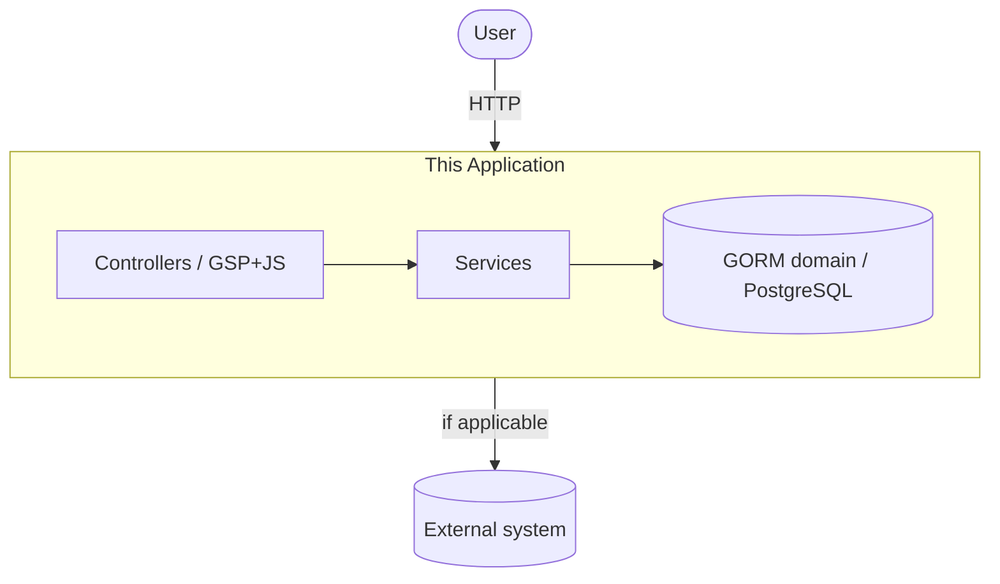

# Implementation Plan — [Project Name]

Derived from `docs/specs/spec.md` — every section below should trace back to
one or more BR-IDs. If you can't trace a design decision to a BR, either the
plan is over-engineering or the spec is missing a rule; fix whichever is
true.

## 1. Architecture overview

Standard Grails MVC layering for this project — controller → service →
domain (GORM). No separate REST client/SPA: pages are GSP views
progressively enhanced with vanilla JS calling JSON endpoints on the same
app. State this explicitly per feature if it deviates (e.g. an
async/queued step).

For anything beyond a single-app project (multiple deployable services,
external system integrations, more than a couple of consumers), sketch a
lightweight C4-style diagram so the shape of the system is visible at a
glance, not just described in prose:

Keep it to context + one level of containers — this is a working diagram
to orient a reader, not exhaustive documentation. Update it when the shape
changes; a stale diagram is worse than no diagram.

If this system talks to external systems, document each integration's
failure/degradation behavior explicitly (timeout handling, retries,
what happens when the external system is down) rather than assuming the
happy path — see `docs/adr/` if the integration approach itself (e.g.
isolating all calls to one system behind a single adapter module) is a
decision worth recording.

## 2. Components

| Component | Grails artifact | Responsibility | BR(s) it must enforce |
|---|---|---|---|
| [e.g. `CustodyService`] | `grails-app/services/.../CustodyService.groovy`, `@Transactional` | all state transitions | BR-1, BR-2, BR-3 |
| [e.g. `CustodyController`] | `grails-app/controllers/.../CustodyController.groovy` | parse input, call service, `respond`/`render` | — (never enforces directly) |
| [e.g. `CustodyRecord`] | `grails-app/domain/.../CustodyRecord.groovy` | GORM constraints, associations | BR-2 (via `constraints`) |

## 3. Data model

Schema / entity design derived from spec §2, expressed as GORM domain
classes: fields, `constraints {}` block, `mapping {}` for anything
non-default (indexes, column types). Note any fields added purely for
implementation reasons (audit timestamps, `version` for optimistic
locking) that are NOT themselves business rules — keep those out of the BR
table but still document them here.

## 4. Layering rule

Controllers never call `.save()`, `.delete()`, or otherwise mutate a GORM
instance directly — all mutation goes through an `@Transactional` service
method. Command objects (`grails.validation.Validateable` or GORM-backed
commands) handle data binding for POST/PUT bodies so mass-assignment is
scoped to explicit, whitelisted properties instead of binding raw request
params onto a domain instance. This becomes a line in
`docs/standards/code-style.md` and a fact the code-review-and-quality skill
checks for.

## 5. Task breakdown

Break the plan into discrete, reviewable tasks. Each task names the BR(s) it
serves and its acceptance/verification step.

| Task | Serves | Acceptance criterion |
|---|---|---|
| [e.g. implement checkout endpoint] | BR-1, BR-2 | `BR-1: ...` and `BR-2: ...` tests pass |

## 6. Open questions / risks

[Anything the spec left ambiguous that this plan had to assume — flag these
for the spec owner to resolve before Code Generation begins, rather than
silently encoding an assumption.]

## 7. Architecturally significant decisions

[List any decision from this plan that's costly to reverse, affects
multiple layers, or changes a cross-cutting concern (a major library
choice, a data-modeling approach, an auth strategy, a deliberate deviation
from `docs/standards/`). Each gets its own ADR in `docs/adr/` — link it
here rather than re-explaining the rationale in the plan.]

| Decision | ADR |
|---|---|
| [e.g. chosen caching approach] | [`docs/adr/NNNN-...md`](../adr/README.md) |
